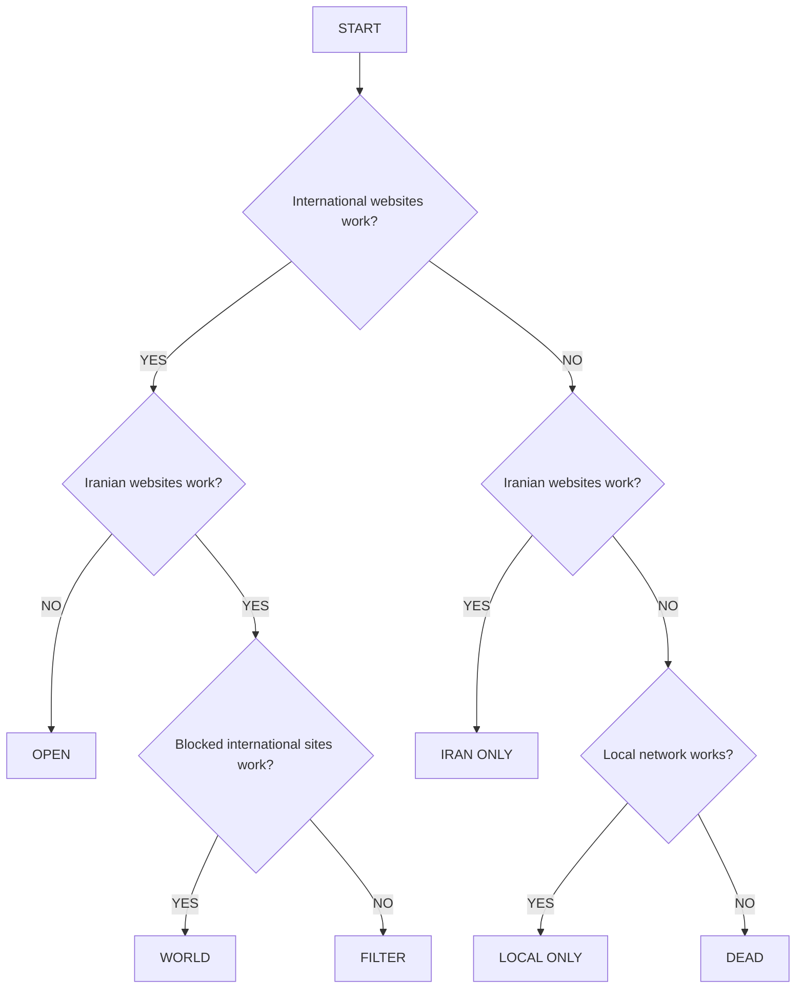

# Hello?

**Hello?** is an open-source Android connectivity detector and home-screen widget that answers a simple question: **what can I actually reach right now?**

It does not treat Wi-Fi or mobile-data connectivity as proof that the Internet is usable. It probes several independent classes of endpoints and classifies the observed network state.

## User-facing states

- **OPEN** — open international access
- **WORLD** — Iranian and international services are both reachable, typically through different routing paths
- **FILTER** — international access exists, but selected major international services are unavailable
- **IRAN ONLY** — only Iranian/national-network services are reachable
- **LOCAL ONLY** — the Internet is unavailable, but a local network is reachable, including a router or phone hotspot
- **DEAD** — neither the wider Internet nor a usable local network is reachable

The app and widget deliberately stay minimal:

> **Hello?**
>
> **World.**

or:

> **Hello?**
>
> **Dead.**

The detailed diagnostic screen is where the technical information belongs.

## Connectivity model

The implementation is probe-based rather than based on a single website or a single Android connectivity flag. A response such as HTTP 404 proves that a server was reached; it is not equivalent to a timeout or connection failure.

## Probe groups

### International

The initial design includes reference endpoints such as:

- `1.1.1.1`
- `8.8.8.8`
- `https://api.ip.sb/geoip`
- `https://www.gstatic.com/generate_204`
- Google
- YouTube
- Telegram
- Facebook

### Iranian

The initial design includes reference services such as:

- `iran.ir`
- Soft98
- Blubank
- Digikala
- Aparat

### Local

Hello? can inspect local-network evidence including:

- Default gateway
- Local IP configuration
- Local DNS
- Local hostnames
- Reachable LAN peers where Android exposes suitable information
- Devices connected through a phone hotspot

The probe list is expected to evolve as testing reveals better reference endpoints. A single site should never be treated as authoritative for an entire network class.

## Local networks and hotspots

A phone hotspot is considered a **local network**, not a separate connectivity state.

If a phone or another device has created a functioning LAN but the wider Internet is unavailable, Hello? may report **LOCAL ONLY**. The diagnostic view can separately show whether the local transport is Wi-Fi, hotspot/tethering, Ethernet, USB tethering, or another supported interface.

## Privacy

Hello? does not require an account or a Hello?-controlled server. Connectivity checks necessarily contact the endpoints being tested, so the application will document its external probes and their purpose.

The classifier does not need browsing history, passwords, messages, contacts, or personal files.

## Development status

**Early development.**

The first repository version establishes the Android application, widget, probe engine, and initial classifier. The classification rules and probe set will be refined through real-world testing across Wi-Fi, mobile data, VPN/rule-based routing, national-network-only conditions, hotspots, and local-only networks.

## Open source and attribution

Hello? is free and open-source software licensed under the **GNU General Public License, version 3 or later**, together with the project's additional attribution terms.

**Original developer:** Mohammed Matin Kabiri

Previous developer and contributor attribution must be preserved in derivative versions as described by `ATTRIBUTION-TERMS.md`.

See:

- [`LICENSE`](LICENSE)
- [`ATTRIBUTION-TERMS.md`](ATTRIBUTION-TERMS.md)
- [`AUTHORS.md`](AUTHORS.md)
- [`CONTRIBUTING.md`](CONTRIBUTING.md)

## License

Copyright © 2026 Mohammed Matin Kabiri and contributors.

GPLv3-or-later applies to the software. The GPL text is reproduced in `LICENSE`; the project's additional attribution terms are in `ATTRIBUTION-TERMS.md`.
